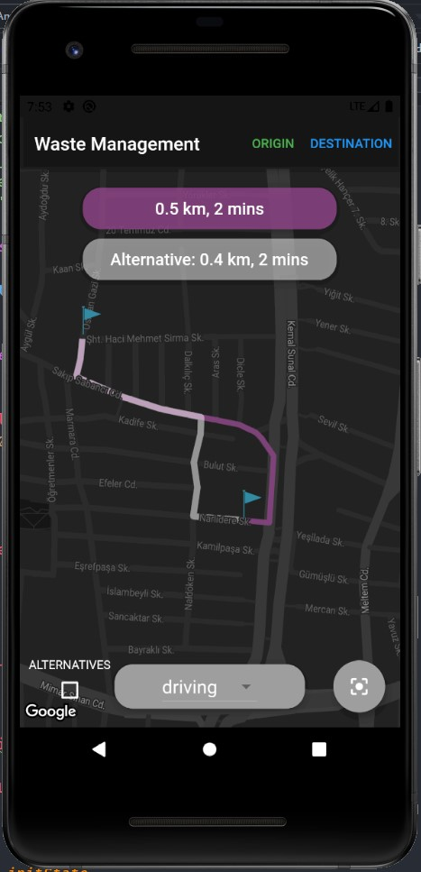
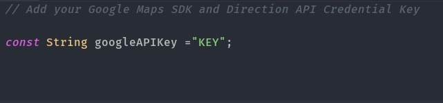
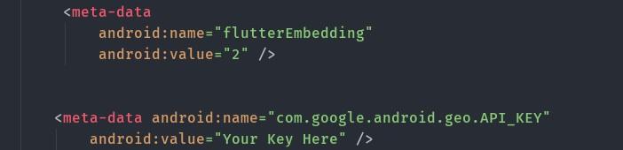

# Draw main route and alternative when added two markes (long press on map will add marker) routes using Google Maps API in Flutter 

## Get Started

- 1. Make pub get
- 2. add your credential key  in ".env.dart" file and /android/app/app/src/main/AndroidManifest.xml

- 3. run project on android device
